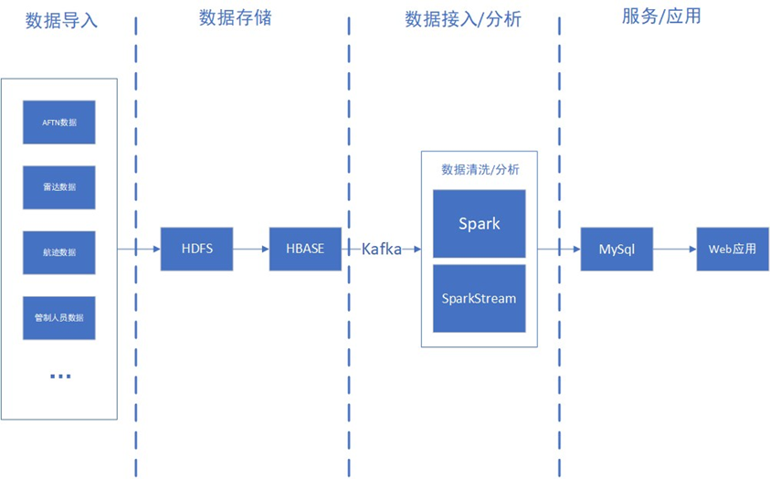
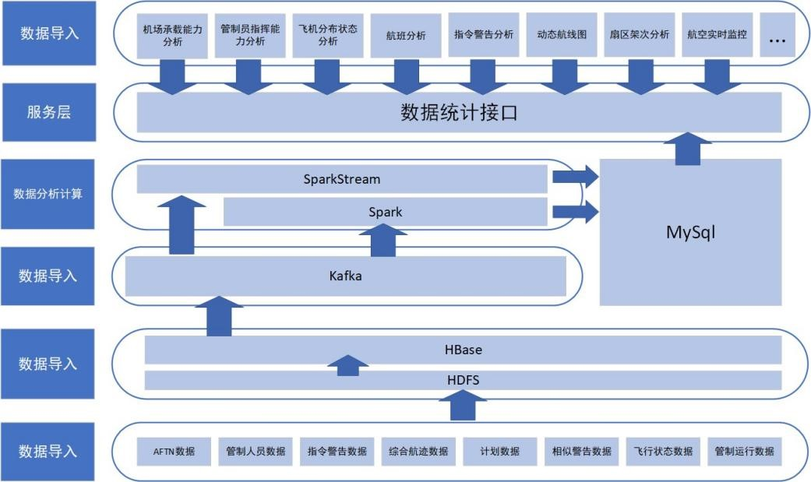
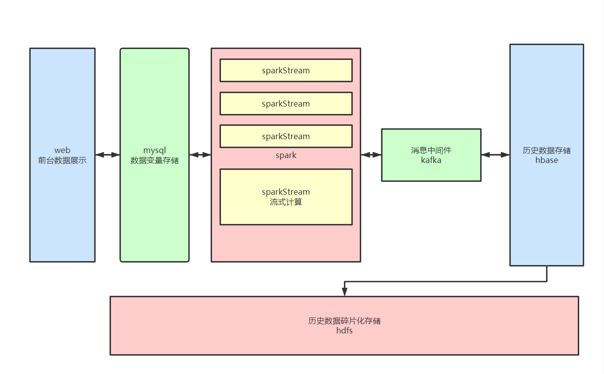

# 
Data-Analytics-and-Practice-2023-Aviation-Project

## 项目概述：
### 1. 项目介绍：  
本项目是用于民航行业一个应用，主要用于管控收集各民航机构上报的雷达数据、航班数据、飞行数据据等，并对其进行标准化处理，形成合理有用的民航数据，通过大数据技术对民航数据进行处理分析，形成各种分析报告和图表，并展示给不同需求的客户。利用成熟的大数据技术，建立数据采集、数据挖掘和数据服务的三层架构，整合空管数据资源，提供统一且灵活的数据服务，提高数据的使用效率，降低维护和开发成本，发挥空管大数据平台的技术优势。项目以实时提供的真实历史数据，通过大数据平台进行清洗、统计并将数据回馈给大屏指挥展示，提供多方位的数据维度图形分析，为航空指挥平台提供决策所用的数据支撑。

---

### 2. 产品范围：
项目通过研究民航空管大数据建设的相关理论和相关技术，结合当地空管数据的实际情况和特点，考虑空管、机场、航空公司的业务交互需求，以当地空管为例，建设当地地区空管大数据平台。
<table>
    <tr>
        <td>产品特征</td> 
        <td>以实时提供的真实历史数据，通过大数据平台进行清洗、统计并将数据回馈给大屏指挥展示，提供多方位的数据维度图形分析，为航空指挥平台提供决策所用的数据支撑</td> 
   </tr>
    <tr>
  		<td>适用领域</td> 
        <td>民航航空指挥领域，区域性航空指挥平台</td> 
    </tr>
    <tr>
        <td>目标收益</td> 
        <td>整合空管数据资源，提供统一且灵活的数据服务，提高数据的使用效率，降低维护和开发成本，发挥空管大数据平台的技术优势</td> 
    </tr>
</table>

---

### 3. 用户群体及角色：
- 普通用户：执行空管、机场、航空公司的业务交互操作；对当前监管的空域进行扇区监管；
- 管理员：同 “普通用户” ；

---

### 4. 运行环境： 
- 硬件环境：需要4台服务器或虚拟机：在3台服务上部署大数据集群,并使用其中1台用于发布，另外需要1台开发服务器;
- 硬件配置：每台集群服务器建议配置：CPU 8核，内存 16G，硬盘 80G；开发服务器的建议配置：CPU 4核，内存 8G，硬盘 80G;
- 操作系统：大数据集群服务器操作系统：Ubuntu ；开发服务器操作系统：Windows 10 
- 开发工具：VSCode
- 大数据环境至少所需组件：Zookeeper, Hadoop, Spark, HBase, Kafka, MySQL, Redis

---

### 5. 假设，依赖和约束：
- 假设：项目的开发环境和运行环境需要访问外网，请确保开发和运行环境可以访问外网
- 依赖：项目中会使用到报表组件和地图组件，这些组件为商业组件，在使用过程中可能会需要注册使用，并可能会产生费用
- 约束：民航空管数据为重要敏感的隐私数据，虽然经过脱敏，但是在未经授权的情况下，禁止任何商业用途

---

## 功能性需求：
### 整体业务流程

---

## 非功能性需求：
###界面需求:
- 登录：用户通过输入用户名和密码进行登录，后台验证用户名密码是否正确，如果不正确给出提示，并且通过后台下发用户权限，进入系统后，会根据用户角色权限显示不同的统计数据板块，进行展示。
- 数据统计：将扇区架次、动态航线图、扇区架次数、扇区通话饱和度，扇区架次数、年度告警统计、指挥航空公司架次、冲突指令告警在首页进行展示。表格数据均采用ECharts进行展示。
- 航空实时监控：实时显示扇区内飞机位置，可以选择不同的扇区查看轨迹数，告警数，扇区内相似航班号提醒以及对管制指令进行纠错。有告警的航班会变红，提示管制员加以注意。

---

## 项目架构
### 1. 总体架构

### 2. 技术架构
<table>
    <tr>
        <td>功能</td> 
        <td>组件</td> 
    </tr>
    <tr>
        <td>消息中间件</td> 
        <td>Kafka</td> 
    </tr>
    <tr>
        <td>数据采集和清洗</td> 
        <td>Spark Streaming</td> 
    </tr>
    <tr>
        <td rowspan="3">存储</td>    
        <td >HDFS</td>
    </tr>
    <tr>
        <td >HBase</td>  
    </tr>
    <tr>
        <td >MySQL</td>  
    </tr>
    <tr>
        <td>实时计算</td> 
        <td>Spark Streaming</td> 
    </tr>
    <tr>
        <td rowspan="3">监控管理调度运维</td>    
        <td >YARN</td>
    </tr>
    <tr>
        <td >Zookeeper</td>  
    </tr>
    <tr>
        <td >ELKELK</td>  
    </tr>
    <tr>
        <td rowspan="2">项目开发框架</td>    
        <td >Spring Boot</td>
    </tr>
    <tr>
        <td >Vue</td>  
    </tr>
</table>

### 3. 项目层级
#### 1. 数据导入层
- 已开启Hadoop HDFS框架环境，已开启HBase框架环境；
- 数据导入期间不进行任何操作，防止节点终端造成数据冗余；
- 高可用：在down掉一个节点后不影响数据传输。
#### 2. 数据存储层
- 数据存储方式多样，对于非结构化的文件类数据存储在HDFS；
- 对于海量的业务数据主要存储在HBase，方便进行操作。
#### 3. 数据分析层

#### 4. 应用层
- 可视化平台：对数据进行分析和展示，提供多种多维度报表和图表展示。
- 实时飞行轨迹：主要根据历史数据进行数据模拟飞行，通过读取历史数据上传到Kafka消息队列。SparkStreaming读取数据后根据电子围栏api获得清洗后扇区数据并保存到MySQL中，供后端调用。

---
###### 参考资料
- 《Linux操作系统》
- 《大数据开发技术（Hadoop）》
- 《Python语言程序设计》、《Python高级应用》
- 《Hive快速大数据分析》
- 《数据分析与实战（Python）》
-《数据可视化技术》
# to be continue......